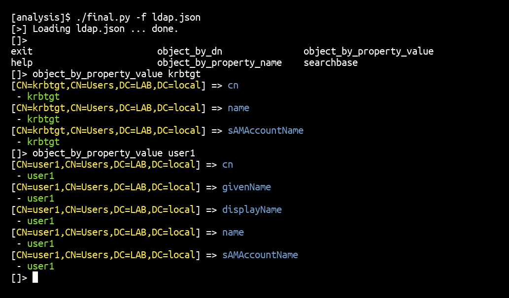

  The ldap2json script allows you to extract the whole LDAP content of a Windows domain into a JSON file.
   
  
  
  
   

## Features

 - [x] Authenticate with password.
 - [x] Authenticate with LM:NT hashes.
 - [x] Authenticate with kerberos ticket.
 - [x] Save LDAP content in json format.

## Presentation and demonstration

  

## LDAP offline analysis tool

This analysis console offers multiple ways of searching LDAP objects from a JSON file. You can search for objects, property names or property values in the console.

## Debug mode

## Contributing

Pull requests are welcome. Feel free to open an issue if you want to add other features.
